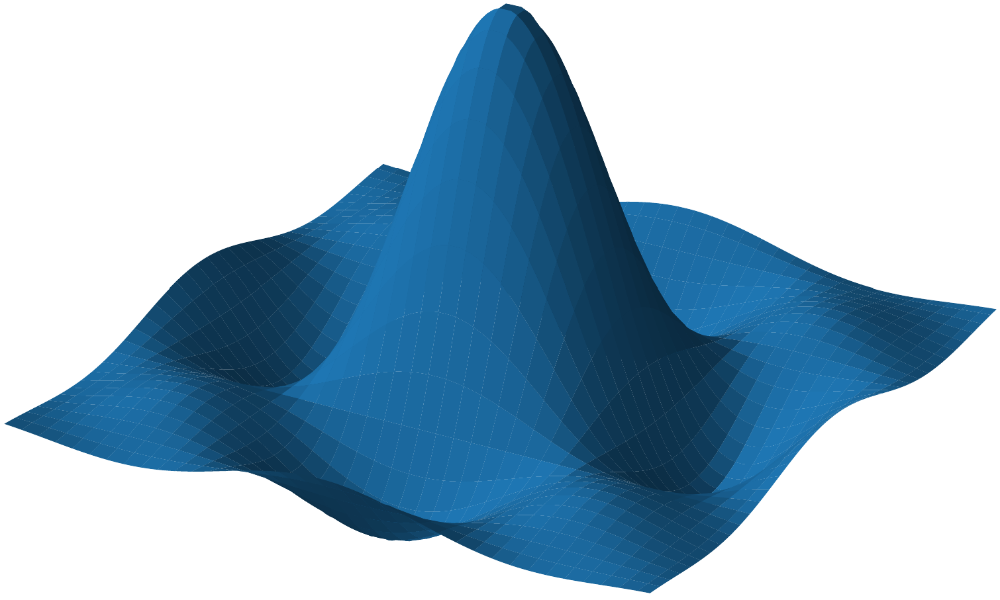

# Fourier Transform of a Polytope

This repository implements Brion formula to compute the Fourier transform of a polytope.
It uses heavily Polymake, through the wrapper Polymake.jl


## Usage
This package has mainly two dependencies, `Polymake.jl` and `LinearAlgebra.jl`.
```julia
using Polymake
using LinearAlgebra

include("src/fourier.jl")
include("src/polytopes.jl")

# Parameters and polytopes.
P = cube(2)
Q = polytope.polarize(P)
R = polytope.Polytope(POINTS = vertices_array([0, 0], [1, 0], [0, 1]))

# Compute Fourier transform.
FP = fourier_transform(P)
FQ = fourier_transform(Q)
FR = fourier_transform(R)
```
For a polytope `P`, `fourier_transform(P)` is a function which can be evaluated at an arbitrary `d`-dimensional array.
